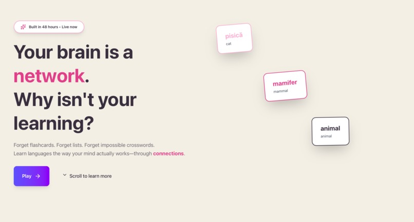
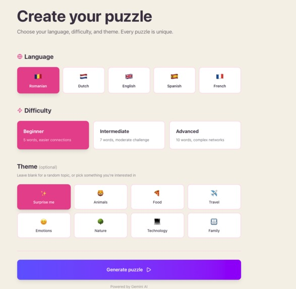
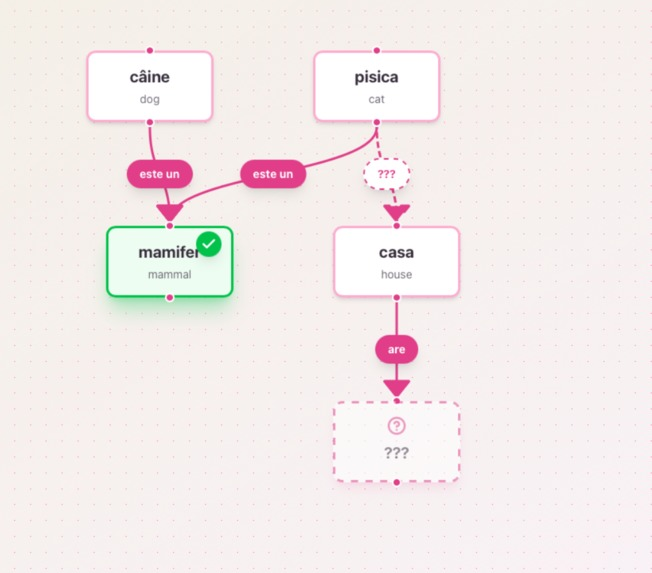
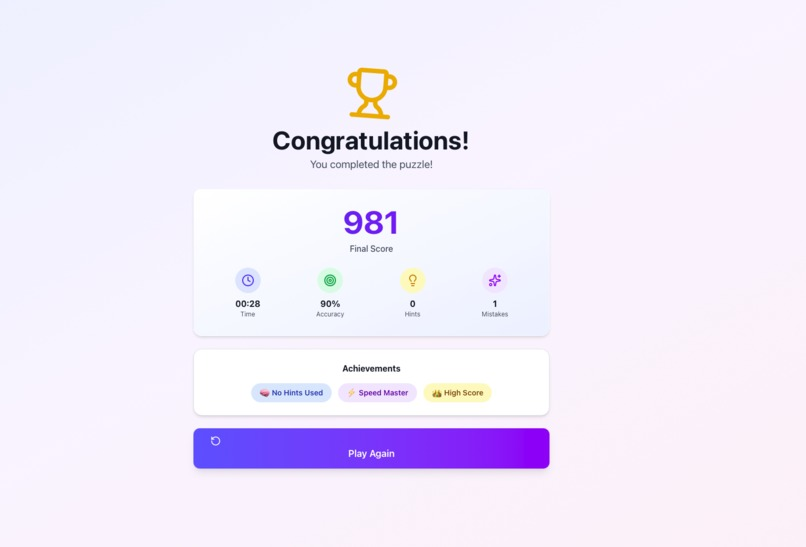

# Nexus - Building your language network

Learn languages through semantic network puzzles! Nexus uses cognitive science principles to teach vocabulary through meaningful connections, not isolation.

## App Preview

<div align="center">

### Landing Page


_Learn about semantic networks and how Nexus works_

### Setup & Customization


_Choose your language, difficulty, and theme_

### Interactive Puzzle


_Complete the graph by filling in missing nodes and relationships_


### Completion & Stats


_View your score, achievements, and detailed statistics_

</div>

## 🔗 Links

- **[Live Demo](https://nexus-two-ashen.vercel.app)** - Try it now!
- **[Devpost](https://devpost.com/software/nexus-v8de17)** - Project submission
- **[Demo Video](https://studio.youtube.com/video/EIF7u5DwxGk/edit)** - Watch the demo
- **[Pitch](https://drive.google.com/file/d/18ZaTFlLngltc0WT0aHmUqglPsWtW6gKt/view?usp=sharing)** - See the pitch
- **[Docs](https://nexus-57.gitbook.io/nexus-docs/)** - See GitBook

## Features

- **Brain-Based Learning**: Based on semantic network theory - how your brain actually learns
- **Interactive Graph Puzzles**: Complete word graphs by filling in missing nodes and relationships
- **5 Languages**
- **AI-Powered**: Uses Gemini API to generate unique puzzles on demand
- **3 Difficulty Levels**: Beginner (5 nodes), Intermediate (7 nodes), Advanced (10 nodes)
- **Progressive Hints**: Get help when stuck with 3 levels of hints per element
- **Score & Stats**: Track your time, accuracy, hints used, and earn achievements
- **Beautiful UI**: Modern, polished interface with smooth animations

## Tech Stack

- **React 19** + **Vite** for fast development
- **@xyflow/react** for interactive graph visualization
- **Gemini API** for AI-powered puzzle generation
- **Tailwind CSS 4** for styling
- **Framer Motion** for animations
- **Lucide React** for icons
- **Canvas Confetti** for celebration effects

## Getting Started

### 1. Clone and Install

```bash
git clone https://github.com/SanzianaGR/nexus
cd nexus
npm install
```

### 2. Set Up Gemini API

1. Get your free Gemini API key from [Google AI Studio](https://makersuite.google.com/app/apikey)
2. Create a `.env` file in the root directory:

```bash
cp .env.example .env
```

3. Add your API key to `.env`:

```
VITE_GEMINI_API_KEY=your_actual_api_key_here
```

### 3. Run Development Server

```bash
npm run dev
```

Open [http://localhost:5173](http://localhost:5173) to view the app!

### 4. Build for Production

```bash
npm run build
npm run preview
```

## How It Works

### Cognitive Science Backing

Nexus is based on **semantic network theory** and **mental clustering** - the idea that our brains learn vocabulary through meaningful connections, not isolated flashcards. By learning words in context with their relationships (like "cat" → "is a" → "mammal"), you build stronger, more natural language understanding.

### Game Flow

1. **Landing Page**: Learn about the concept with demo graph
2. **Setup Page**: Choose language, difficulty, and optional theme
3. **Puzzle Page**: Complete the graph by filling in hidden nodes and edges
4. **Completion Page**: See your score, stats, and achievements!

### Puzzle Generation

The app uses Gemini API to generate unique puzzles based on:

- Target language
- Difficulty level (controls node count and hidden elements)
- Optional theme (animals, food, travel, etc.)

Each puzzle is a connected graph where:

- **Nodes** = vocabulary words (some hidden)
- **Edges** = labeled relationships (some hidden)

Puzzles are cached locally to avoid regeneration.

### Scoring System

- Base score: 1000 points
- Time penalty: -1 point per second
- Hint penalty: -10 points per hint
- Accuracy bonus: +50 points for no mistakes

## Project Structure

```
src/
├── components/
│   ├── Graph/          # React Flow graph components
│   │   ├── GraphCanvas.jsx
│   │   ├── CustomNode.jsx
│   │   └── CustomEdge.jsx
│   ├── Modals/         # Input and hint modals
│   │   └── InputModal.jsx
│   ├── Game/           # Game UI components
│   │   ├── Header.jsx
│   │   └── Sidebar.jsx
│   ├── Pages/          # Main pages
│   │   ├── Landing.jsx
│   │   ├── Setup.jsx
│   │   ├── Puzzle.jsx
│   │   └── Completion.jsx
│   └── UI/             # Reusable UI components
│       ├── Button.jsx
│       ├── Card.jsx
│       └── Loading.jsx
├── hooks/              # Custom React hooks
│   ├── useGemini.js    # API integration
│   ├── useTimer.js
│   └── useScore.js
├── utils/              # Utility functions
│   ├── validation.js   # Answer validation with fuzzy matching
│   └── storage.js      # localStorage helpers
├── context/            # React Context
│   └── GameContext.jsx # Global game state
└── App.jsx             # Main app with routing
```

Powered by Google Gemini AI
