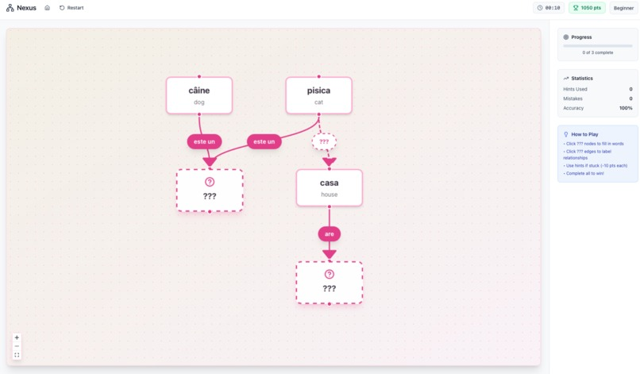
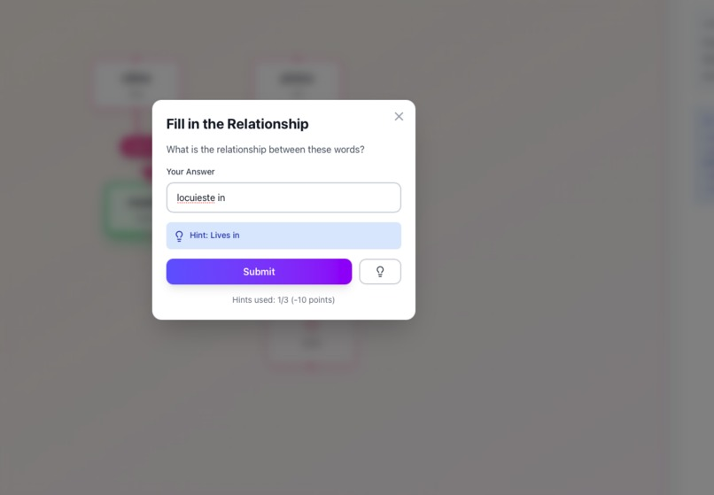

# Development Guide

## 1. Getting Started

### 1.1 Prerequisites

**Required**:

* Node.js 18+ (LTS recommended)
* npm 9+ or yarn 1.22+
* Git
* Code editor (VS Code recommended)
* Google Gemini API key

**Optional**:

* React DevTools browser extension
* ESLint extension for code editor

### 1.2 System Requirements

**Development Machine**:

* OS: macOS, Windows, or Linux
* RAM: 4GB minimum, 8GB recommended
* Disk Space: 500MB for dependencies

**Browser Requirements**:

* Chrome 90+, Firefox 88+, Safari 14+, or Edge 90+
* JavaScript enabled
* localStorage enabled

***

## 2. Installation

### 2.1 Clone Repository

```bash
# HTTPS
git clone https://github.com/SanzianaGR/nexus.git

# SSH
git clone git@github.com:SanzianaGR/nexus.git

# Navigate to project
cd nexus
```

### 2.2 Install Dependencies

```bash
# Using npm
npm install

# Using yarn
yarn install
```

**Installation Time**: \~2-3 minutes on broadband

**Packages Installed**:

* Production: React, React Router, Vite, Tailwind CSS, Framer Motion, React Flow, Gemini AI SDK
* Development: ESLint, Vite plugins

### 2.3 Configure Environment Variables

```bash
# Copy example file
cp .env.example .env

# Edit .env file
# macOS/Linux
nano .env

# Windows
notepad .env
```

**Required Configuration**:

```bash
VITE_GEMINI_API_KEY=your_actual_api_key_here
```

**Get API Key**:

1. Visit [Google AI Studio](https://makersuite.google.com/app/apikey)
2. Sign in with Google account
3. Click "Create API Key"
4. Copy key and paste into `.env` file

**Important**: Never commit `.env` to version control (already in `.gitignore`)

***

## 3. Running the Application

### 3.1 Development Server

```bash
npm run dev
```

**Output**:

```
VITE v7.2.2  ready in 543 ms

➜  Local:   http://localhost:5173/
➜  Network: use --host to expose
➜  press h + enter to show help
```

**Features**:

* Hot Module Replacement (HMR) - instant updates
* Fast Refresh for React components
* Source maps for debugging
* Port: 5173 (default, auto-increments if busy)

**Stopping Server**: `Ctrl + C`

### 3.2 Production Build

```bash
# Build for production
npm run build

# Output: /dist directory
```

**Build Output**:

```
vite v7.2.2 building for production...
✓ 234 modules transformed.
dist/index.html                   0.46 kB │ gzip:  0.30 kB
dist/assets/index-BwZ4J8Xq.css   42.15 kB │ gzip: 10.23 kB
dist/assets/index-DkH9xL2p.js   287.84 kB │ gzip: 95.12 kB
✓ built in 3.45s
```

**Preview Production Build**:

```bash
npm run preview

# Opens on http://localhost:4173
```

***

## 4. Application Screens

### 4.1 Landing Page

.jpg>)

The landing page features:

* Hero section with tagline
* Interactive demo graph
* Explanation of semantic network theory
* Call-to-action to start learning

### 4.2 Setup Screen

.jpg>)

Configuration options:

* Language selection (7 languages)
* Difficulty level (Beginner/Intermediate/Advanced)
* Optional theme selection
* Beautiful card-based UI

### 4.3 Puzzle Canvas

.jpg>) 

Main game interface showing:

* Interactive React Flow graph
* Hidden nodes and edges
* Progress sidebar with stats
* Timer and hint system
* Custom styled nodes and edges

### 4.4 Input Modal



Clean input interface for:

* Answer submission
* Real-time validation
* Hint display
* Translation support

### 4.5 Completion Screen

.jpg>)

Results page displaying:

* Final score breakdown
* Time and accuracy metrics
* Achievement badges
* Next puzzle option

***

## 5. Development Workflow

### 5.1 Recommended Workflow

1.  **Pull Latest Changes**

    ```bash
    git pull origin main
    ```
2.  **Create Feature Branch**

    ```bash
    git checkout -b feature/your-feature-name
    ```
3. **Make Changes**
   * Edit code
   * Test in browser (auto-refresh with HMR)
4.  **Lint Code**

    ```bash
    npm run lint
    ```
5.  **Commit Changes**

    ```bash
    git add .
    git commit -m "Add: brief description of changes"
    ```
6.  **Push to Remote**

    ```bash
    git push origin feature/your-feature-name
    ```
7. **Create Pull Request** (on GitHub)

### 5.2 Code Style Guidelines

**React Components**:

* Use functional components only (no classes)
* Prefer named exports for components
* Use PascalCase for component names
* Use camelCase for functions and variables

**File Naming**:

* Components: `PascalCase.jsx` (e.g., `GraphCanvas.jsx`)
* Utilities: `camelCase.js` (e.g., `validation.js`)
* Hooks: `useCamelCase.js` (e.g., `useGemini.js`)

**Component Structure**:

```javascript
// 1. Imports
import { useState } from 'react';
import { useGame } from '../context/GameContext';

// 2. Component definition
export function MyComponent({ prop1, prop2 }) {
  // 3. Hooks
  const { state } = useGame();
  const [localState, setLocalState] = useState(null);

  // 4. Event handlers
  const handleClick = () => {
    // ...
  };

  // 5. Effects
  useEffect(() => {
    // ...
  }, [dependencies]);

  // 6. Render
  return (
    <div>
      {/* JSX */}
    </div>
  );
}
```

**Tailwind CSS**:

* Use utility classes (avoid custom CSS when possible)
* Use responsive breakpoints: `sm:`, `md:`, `lg:`
* Use Tailwind color palette
* Group related utilities: `className="flex items-center gap-2"`

**ESLint Rules**:

* No unused variables (except with `_` prefix)
* React Hooks rules enforced
* Prefer `const` over `let`
* No `var` usage

***

## 6. Project Structure Guide

### 6.1 Directory Organization

```
nexus/
├── public/              # Static assets (served as-is)
│   └── vite.svg
├── src/                 # Source code
│   ├── assets/          # Images, fonts
│   ├── components/      # React components
│   │   ├── Game/        # Game-specific UI
│   │   ├── Graph/       # Graph visualization
│   │   ├── Modals/      # Modal dialogs
│   │   ├── Pages/       # Full-page components
│   │   └── UI/          # Reusable UI components
│   ├── context/         # React Context providers
│   ├── hooks/           # Custom React hooks
│   ├── utils/           # Utility functions
│   ├── App.jsx          # Main app component
│   ├── main.jsx         # React entry point
│   └── index.css        # Global styles
├── docs/                # Documentation (GitBook)
├── .env                 # Environment variables (gitignored)
├── .env.example         # Environment template
├── .gitignore           # Git ignore rules
├── eslint.config.js     # ESLint configuration
├── index.html           # HTML entry point
├── package.json         # Dependencies and scripts
├── vite.config.js       # Vite configuration
└── README.md            # Project README
```

### 6.2 When to Create New Files

**New Component**:

* Create in appropriate subfolder under `/src/components/`
* Export as named export
* Import in parent component

**New Hook**:

* Create in `/src/hooks/`
* Prefix with `use` (e.g., `useLocalStorage.js`)
* Export as named export

**New Utility**:

* Create in `/src/utils/`
* Export individual functions
* Keep utilities pure (no side effects)

**New Page**:

* Create in `/src/components/Pages/`
* Add route in `/src/App.jsx`
* Update navigation links

***

## 7. Common Development Tasks

### 7.1 Adding a New Language

**Steps**:

1. **Update Language List** (`/src/components/Pages/Setup.jsx`):

```javascript
const LANGUAGES = [
  { code: 'romanian', name: 'Romanian', flag: '🇷🇴' },
  { code: 'spanish', name: 'Spanish', flag: '🇪🇸' },
  // Add new language:
  { code: 'japanese', name: 'Japanese', flag: '🇯🇵' },
];
```

2. **Add Grammar Rules** (`/src/hooks/useGemini.js`):

```javascript
const GRAMMAR_RULES = {
  japanese: `
    - Include proper particle usage (は、が、を、に、etc.)
    - Use kanji with furigana pronunciation
    - Include politeness levels when appropriate
    - Use hiragana/katakana correctly
  `,
  // ...
};
```

3. **Add Fallback Puzzle** (`/src/hooks/useGemini.js`):

```javascript
const FALLBACK_PUZZLES = {
  japanese_beginner: {
    nodes: [
      { id: "1", word: "ねこ", translation: "cat", pronunciation: "neko", hidden: false },
      // ...
    ],
    edges: [ /* ... */ ],
    theme: "animals",
    difficulty: "beginner"
  },
  // ...
};
```

4. **Test Generation**:

```bash
# Start dev server
npm run dev

# Navigate to /setup
# Select Japanese, generate puzzle
# Verify correct grammar and structure
```

### 7.2 Adding a New Difficulty Level

**Steps**:

1. **Define Parameters** (`/src/hooks/useGemini.js`):

```javascript
const DIFFICULTY_PARAMS = {
  beginner: { nodes: 5, hiddenNodes: 2, hiddenEdges: 1 },
  intermediate: { nodes: 7, hiddenNodes: 4, hiddenEdges: 2 },
  advanced: { nodes: 10, hiddenNodes: 6, hiddenEdges: 3 },
  // Add expert level:
  expert: { nodes: 15, hiddenNodes: 10, hiddenEdges: 5 },
};
```

2. **Update UI** (`/src/components/Pages/Setup.jsx`):

```javascript
const DIFFICULTIES = [
  { level: 'beginner', nodes: 5, hidden: 3 },
  { level: 'intermediate', nodes: 7, hidden: 6 },
  { level: 'advanced', nodes: 10, hidden: 9 },
  { level: 'expert', nodes: 15, hidden: 15 },
];
```

3. **Adjust Scoring** (if needed) (`/src/hooks/useScore.js`):

```javascript
const BASE_SCORES = {
  beginner: 1000,
  intermediate: 1500,
  advanced: 2000,
  expert: 3000,
};
```

### 7.3 Customizing Validation Threshold

**Location**: `/src/utils/validation.js`

**Current**: 85% similarity

**Adjust**:

```javascript
// More strict (90%)
export function validateAnswer(userAnswer, correctAnswer, threshold = 0.90) {
  // ...
}

// More lenient (80%)
export function validateAnswer(userAnswer, correctAnswer, threshold = 0.80) {
  // ...
}
```

**Testing**:

```javascript
// Test in browser console
import { validateAnswer } from './utils/validation';

validateAnswer("pisica", "pisiica");  // Check if accepted
validateAnswer("casa", "grădină");    // Should be rejected
```

### 7.4 Modifying Cache Duration

**Location**: `/src/utils/storage.js`

**Current**: 24 hours

**Adjust**:

```javascript
// 1 hour
const CACHE_EXPIRATION = 1 * 60 * 60 * 1000;

// 1 week
const CACHE_EXPIRATION = 7 * 24 * 60 * 60 * 1000;

// Disable caching (always fresh)
const CACHE_EXPIRATION = 0;
```

### 7.5 Adding New Achievement Badges

**Location**: `/src/components/Pages/Completion.jsx`

**Steps**:

1. **Define Achievement Logic**:

```javascript
const achievements = [
  {
    id: 'perfect',
    name: 'Perfect Accuracy',
    description: '100% accuracy',
    earned: mistakes === 0,
    icon: '🎯',
  },
  // Add new achievement:
  {
    id: 'lightning',
    name: 'Lightning Fast',
    description: 'Completed in under 1 minute',
    earned: timer.seconds < 60,
    icon: '⚡',
  },
];
```

2. **Render Badge**:

```javascript
{achievements.map(achievement => (
  <div
    key={achievement.id}
    className={achievement.earned ? 'opacity-100' : 'opacity-30'}
  >
    <span className="text-4xl">{achievement.icon}</span>
    <p className="font-bold">{achievement.name}</p>
    <p className="text-sm">{achievement.description}</p>
  </div>
))}
```

***

## 8. Debugging

### 8.1 React DevTools

**Installation**:

* [Chrome Extension](https://chrome.google.com/webstore/detail/react-developer-tools/fmkadmapgofadopljbjfkapdkoienihi)
* [Firefox Extension](https://addons.mozilla.org/en-US/firefox/addon/react-devtools/)

**Usage**:

1. Open browser DevTools (F12)
2. Navigate to "Components" tab
3. Inspect component tree, props, state
4. Navigate to "Profiler" tab for performance analysis

**Tips**:

* Click component to inspect props/state
* Edit state values live
* Track component re-renders

### 8.2 Vite Debugging

**Enable Source Maps** (already enabled):

```javascript
// vite.config.js
export default defineConfig({
  build: {
    sourcemap: true,  // Enables source maps
  },
});
```

**View Original Code**:

1. Open DevTools → Sources tab
2. Navigate to `webpack://` or `vite://`
3. Find original `.jsx` files
4. Set breakpoints

### 8.3 Common Issues

**Issue**: API key not working in production

**Solution**:

* Verify environment variable set in hosting platform
* Ensure `VITE_` prefix used
* Redeploy after setting variable

***

**Issue**: Graph not rendering

**Solution**:

```javascript
// Check browser console for errors
// Verify puzzle structure:
console.log(currentPuzzle);

// Check if nodes/edges exist:
if (!currentPuzzle?.nodes?.length) {
  console.error('No nodes in puzzle');
}
```

***

**Issue**: Changes not reflecting in browser

**Solution**:

* Hard refresh: `Ctrl+Shift+R` (Windows/Linux) or `Cmd+Shift+R` (macOS)
* Clear cache: DevTools → Network tab → "Disable cache"
* Restart Vite dev server

***

**Issue**: ESLint errors in editor

**Solution**:

```bash
# Run lint to see all errors
npm run lint

# Auto-fix simple errors
npx eslint --fix .
```

***

## 9. Testing

### 9.1 Manual Testing Checklist

**Before Commit**:

* [ ] Test on desktop browser (Chrome/Firefox)
* [ ] Test on mobile browser (real device or DevTools mobile mode)
* [ ] Verify all routes work (/, /setup, /game, /completion)
* [ ] Test with and without API key (fallback puzzles)
* [ ] Check browser console for errors
* [ ] Run ESLint: `npm run lint`

**Feature Testing**:

* [ ] Generate puzzle for each language
* [ ] Generate puzzle for each difficulty
* [ ] Test hint system (all 3 levels)
* [ ] Submit correct answer → verify green node
* [ ] Submit incorrect answer → verify red feedback
* [ ] Complete puzzle → verify confetti animation
* [ ] Check score calculation accuracy
* [ ] Test timer start/pause/reset

### 9.2 Automated Testing (Future)

**Recommended Stack**:

* **Unit Tests**: Vitest (Vite-native test runner)
* **Component Tests**: React Testing Library
* **E2E Tests**: Playwright or Cypress

**Example Unit Test** (future):

```javascript
// validation.test.js
import { describe, it, expect } from 'vitest';
import { validateAnswer } from './utils/validation';

describe('validateAnswer', () => {
  it('accepts exact matches', () => {
    const result = validateAnswer('pisica', 'pisica');
    expect(result.isCorrect).toBe(true);
    expect(result.similarity).toBe(1);
  });

  it('accepts minor typos', () => {
    const result = validateAnswer('pisiica', 'pisica');
    expect(result.isCorrect).toBe(true);
  });

  it('rejects completely different words', () => {
    const result = validateAnswer('cat', 'pisica');
    expect(result.isCorrect).toBe(false);
  });
});
```

***

## 10. Deployment

### 10.1 Vercel Deployment

**Prerequisites**:

* GitHub account
* Vercel account (free tier)

**Steps**:

1.  **Push Code to GitHub**:

    ```bash
    git push origin main
    ```
2. **Connect to Vercel**:
   * Visit [vercel.com](https://vercel.com)
   * Click "New Project"
   * Import GitHub repository
   * Select `nexus` repository
3. **Configure Build**:
   * Framework Preset: Vite
   * Build Command: `npm run build`
   * Output Directory: `dist`
   * Install Command: `npm install`
4. **Set Environment Variables**:
   * Go to Project Settings → Environment Variables
   * Add: `VITE_GEMINI_API_KEY` = `your_api_key`
   * Scope: Production, Preview, Development
5. **Deploy**:
   * Click "Deploy"
   * Wait 2-3 minutes
   * Visit deployed URL

**Auto-Deployment**:

* Every push to `main` triggers re-deployment
* Pull requests create preview deployments

### 10.2 Netlify Deployment

**Steps**:

1.  **Create `netlify.toml`**:

    ```toml
    [build]
      command = "npm run build"
      publish = "dist"

    [[redirects]]
      from = "/*"
      to = "/index.html"
      status = 200
    ```
2. **Connect to Netlify**:
   * Visit [netlify.com](https://netlify.com)
   * Click "Add new site" → "Import an existing project"
   * Connect GitHub repository
3. **Configure**:
   * Build command: `npm run build`
   * Publish directory: `dist`
   * Environment variables: Add `VITE_GEMINI_API_KEY`
4. **Deploy**:
   * Click "Deploy site"
   * Wait for deployment
   * Visit deployed URL

### 10.3 GitHub Pages Deployment

**Not Recommended** (requires extra configuration for SPA routing)

**Alternative**: Use Vercel or Netlify for easier setup

***

## 11. Contributing

### 11.1 How to Contribute

1. **Fork Repository**
   * Click "Fork" on GitHub
2.  **Clone Your Fork**

    ```bash
    git clone https://github.com/YOUR_USERNAME/nexus.git
    ```
3.  **Create Branch**

    ```bash
    git checkout -b feature/your-feature
    ```
4. **Make Changes**
   * Follow code style guidelines
   * Add comments for complex logic
   * Test thoroughly
5.  **Commit**

    ```bash
    git add .
    git commit -m "Add: feature description"
    ```
6.  **Push**

    ```bash
    git push origin feature/your-feature
    ```
7. **Create Pull Request**
   * Go to original repository on GitHub
   * Click "New Pull Request"
   * Describe changes, link issues

### 11.2 Pull Request Guidelines

**Title Format**:

* `Add: new feature`
* `Fix: bug description`
* `Update: component/file changed`
* `Refactor: improvement made`

**Description Should Include**:

* What changed
* Why it changed
* How to test
* Screenshots (if UI change)

**Before Submitting**:

* [ ] Code follows style guidelines
* [ ] No ESLint errors
* [ ] Tested on desktop and mobile
* [ ] No console errors
* [ ] Builds successfully

***

## 12. Resources

### 12.1 Documentation Links

* [React Docs](https://react.dev)
* [Vite Docs](https://vitejs.dev)
* [Tailwind CSS Docs](https://tailwindcss.com/docs)
* [Framer Motion Docs](https://www.framer.com/motion/)
* [React Flow Docs](https://reactflow.dev)
* [Gemini API Docs](https://ai.google.dev/docs)

### 12.2 Learning Resources

**React**:

* [React Tutorial](https://react.dev/learn)
* [React Hooks Guide](https://react.dev/reference/react)

**Vite**:

* [Vite Guide](https://vitejs.dev/guide/)

**Tailwind CSS**:

* [Tailwind Utility Classes](https://tailwindcss.com/docs/utility-first)
* [Responsive Design](https://tailwindcss.com/docs/responsive-design)

### 12.3 Community

* [GitHub Issues](https://github.com/SanzianaGR/nexus/issues)
* [GitHub Discussions](https://github.com/SanzianaGR/nexus/discussions)

***

This development guide provides everything needed to start contributing to Nexus. Happy coding!
